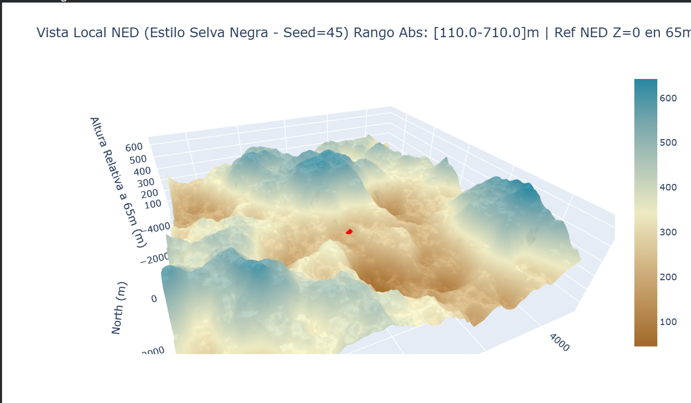

# Procedural Terrain Generator for UAV Simulation

### [Public Portfolio Version]

This repository showcases a Python-based tool for generating realistic, **georeferenced** Digital Surface Models (DSMs) for robotics and UAV simulation.

This script is a bridge between **Geosciences** (procedural generation) and **Geomatics** (GIS data export), built to support **Robotics** or OTHER Geospatial simulations.

*The full script is maintained privately, but this repository demonstrates its architecture and final output.*

## Objective

To procedurally create varied, large-scale terrain (simulating environments like the Black Forest in Germany) with precise control over altitude ranges, and export the result as a **simulation-ready GeoTIFF**.

## Core Features

* **Procedural Generation:** Uses Fractional Brownian Motion (FBM) via the `noise` library to create realistic, non-repeating terrain features.
* **Geodetically-Aware Export:** Uses `Rasterio` and `PyProj` to export the final DSM as a valid **GeoTIFF**, correctly georeferenced in either Geographic (EPSG:4326) or Projected (UTM) coordinate systems.
* **Simulation-Ready Visualization:** Generates an interactive 3D plot using `Plotly` showing the terrain in a local NED (North-East-Down) frame, including a simulated drone position.
* **Full Control:** Allows precise control over terrain parameters like scale, octaves, persistence, and (most importantly) the final absolute min/max altitude range.

## Tech Stack
* **Core:** Python, NumPy
* **Geospatial:** Rasterio, PyProj, PyMap3D
* **Generation:** noise (Perlin/FBM)
* **Visualization:** Plotly

## Example Output (Simulating the Black Forest)

*A 10km x 10km georeferenced DSM with a 600m altitude range, visualized in a local NED frame with a drone marker.*

